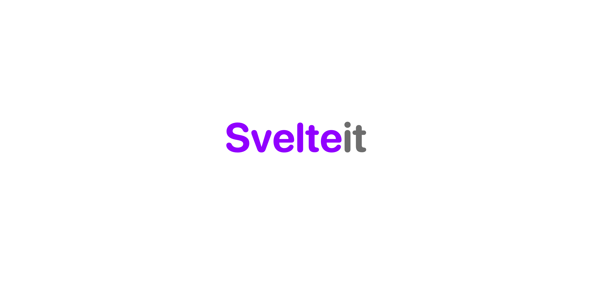

# Svelte<em>it</em> - https://docs.svelteit.dev

<a align="center" href="https://docs.svelteit.dev"></a>

Svelteit is a minimalistic UI/UX component framework for [Svelte](https://svelte.dev) and [Sapper](https://sapper.svelte.dev) projects.

### Why?

Yes, there are many component frameworks out there today, but we wanted our own. If you like our components, use it. If you see a problem, make a pull request or fork your own and roll with it.

### Quick Installation

Add Svelteit to your project by running:

```bash
npm install -D @colorfuldots/svelteit
# or
yarn add @colorfuldots/svelteit --dev
```

### Documentation

- [Svelteit Docs](https://github.com/erictherobot/svelteit-docs)

### Contributing

Please read our [Contribution Guideline - (Svelte<em>it</em> Docs)](https://github.com/erictherobot/svelteit-docs/blob/master/CONTRIBUTING.md) and [Contribution Guideline - (Svelte<em>it</em>)](https://github.com/erictherobot/svelteit/blob/master/CONTRIBUTING.md)

### MIT License

Copyright (c) 2020 Colorful Dots, LLC (https://colorfuldots.com)
Permission is hereby granted, free of charge, to any person
obtaining a copy of this software and associated documentation
files (the "Software"), to deal in the Software without
restriction, including without limitation the rights to use,
copy, modify, merge, publish, distribute, sublicense, and/or sell
copies of the Software, and to permit persons to whom the
Software is furnished to do so, subject to the following
conditions:

The above copyright notice and this permission notice shall be
included in all copies or substantial portions of the Software.

THE SOFTWARE IS PROVIDED "AS IS", WITHOUT WARRANTY OF ANY KIND,
EXPRESS OR IMPLIED, INCLUDING BUT NOT LIMITED TO THE WARRANTIES
OF MERCHANTABILITY, FITNESS FOR A PARTICULAR PURPOSE AND
NON-INFRINGEMENT. IN NO EVENT SHALL THE AUTHORS OR COPYRIGHT
HOLDERS BE LIABLE FOR ANY CLAIM, DAMAGES OR OTHER LIABILITY,
WHETHER IN AN ACTION OF CONTRACT, TORT OR OTHERWISE, ARISING
FROM, OUT OF OR IN CONNECTION WITH THE SOFTWARE OR THE USE OR
OTHER DEALINGS IN THE SOFTWARE.

View [MIT License](https://github.com/erictherobot/svelteit/blob/master/LICENSE.md)
